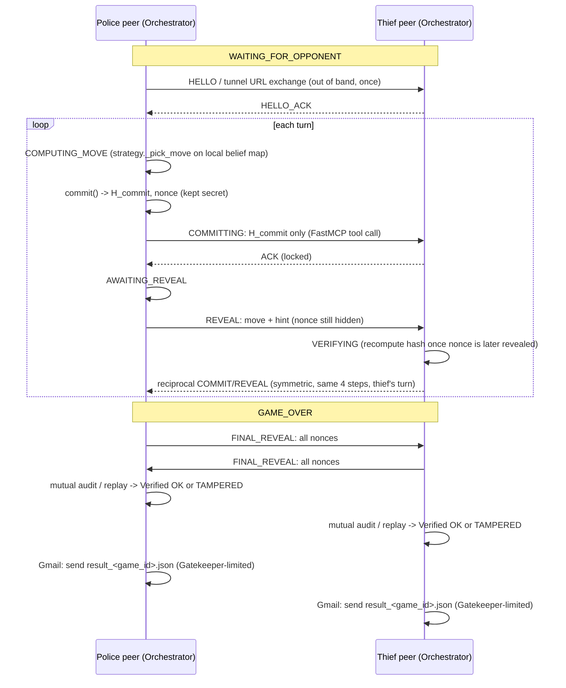
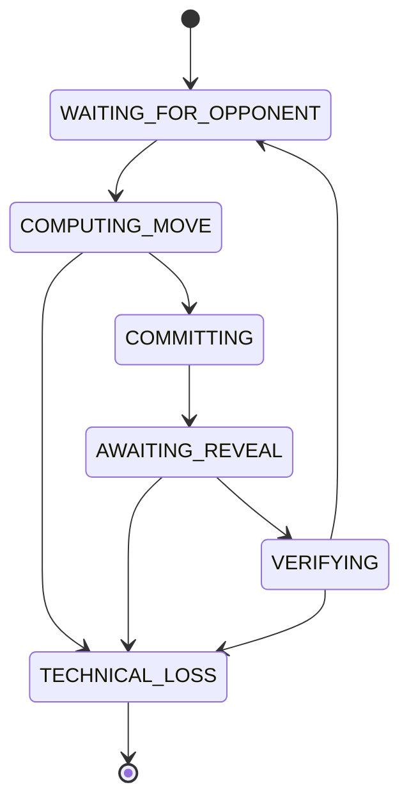

# Architecture — Police–Thief P2P

Companion to `docs/requirements_analysis.md` (requirement IDs referenced throughout) and
`docs/protocol.md` (wire-level detail). Diagrams use Mermaid.

## 1. Guiding principles

- **No central judge** (FR-050/§2.2.1): each peer enforces the rules on itself and verifies the
  opponent cryptographically. There is no server that holds ground truth.
- **Separation of concerns** (NFR-001, §8.2): deterministic game/domain logic never imports
  networking or UI code. Strategy is pluggable and isolated from the crypto/protocol layer (§6.2).
- **Single Gateway per peer** (FR-052, §8.3): one `Orchestrator` object owns the state machine and
  is the only component that talks to the MCP connector, the decision (strategy) module, the log
  manager, the deadline tracker, and the watchdog. No other component reaches across that boundary.
- **Local Truth only** (FR-005/FR-070): anything rendered to a human, or handed to a strategy
  module, is scoped to what that peer is epistemically allowed to know — its own position, its own
  belief map, and messages actually received. Never the objective board.
- **Config, not code, is the constitution** (§3.2, NFR-005): board size, movement rules, scoring,
  scent parameters, and network limits all come from `config/game.json` (shared+signed) and
  `config/game.toml` (private per peer) — never hardcoded.

## 2. Package layout

```
src/police_thief/
├── domain/            # deterministic, no I/O, no network — unit-testable in isolation
│   ├── board.py       #   grid, coordinates, barrier placement, capture/win rules   (FR-010..018, FR-020..021)
│   ├── scent.py        #   pheromone emission/decay, belief-map update              (FR-030..032)
│   ├── state_machine.py#   GamePhaseMachine + transition table                     (FR-052)
│   ├── crypto.py       #   commit()/verify(), canonical JSON, nonce                 (FR-040..045)
│   └── models.py       #   dataclasses: Move, Coordinate, GameConfig, Declaration…
├── strategy/
│   ├── base.py         #   BrainBase / ThiefBrain / PoliceBrain ABCs               (FR-060..061)
│   ├── heuristic.py     #  default Manhattan+belief-argmax brain                   (FR-032)
│   ├── qlearning.py     #  optional RL brain                                       (BONUS-001)
│   └── llm_bluff.py     #  text-only banter provider (template/ollama/claude_*)     (FR-062..064)
├── infra/
│   ├── mcp_server.py    #  FastMCP tool exposure (this peer's server half)          (FR-050..051)
│   ├── mcp_client.py    #  calls into the opponent's exposed tools                  (FR-050)
│   ├── tunnel.py        #  ngrok/Localtonet lifecycle wrapper                       (FR-006)
│   ├── gatekeeper.py     #  Quota Manager -> TokenBucket -> DOS Detector pipeline    (FR-055, NFR-006)
│   ├── gmail_report.py   #  OAuth2 send-only Gmail reporting                        (FR-080..082)
│   └── watchdog.py       #  heartbeat + deadline tracker                            (FR-053..054)
├── orchestrator.py      #  Single Gateway: owns state machine, wires everything     (FR-052)
├── config.py            #  loads+validates config/game.json + game.toml            (NFR-005, A-003, A-009)
├── logging_setup.py      #  structured logging, no-secrets policy                  (NFR-004)
├── gui/
│   ├── live_view.py      #  Tkinter live GUI: local belief heatmap + turn banner    (FR-070)
│   └── replay_viewer.py  #  loads log, recomputes hashes, Verified OK / TAMPERED    (FR-071..072)
└── cli.py                #  `python -m police_thief peer --role ...`, `replay ...`

config/
├── game.json             #  shared, signed, byte-identical on both sides           (NFR-008)
├── police/game.toml       #  private, police side only                             (§2.4.2 mandatory separation)
└── thief/game.toml        #  private, thief side only

tests/
├── unit/  protocol/  network/  integration/  e2e/
```

Dependency direction (enforced by import discipline + a lint rule, not just convention):
`gui` → `orchestrator` → `{infra, strategy}` → `domain`. `domain` depends on nothing else in this
project. `strategy` depends only on `domain` (+ its own LLM infra client interface, injected).

## 3. Component responsibilities

| Component | Responsibility | Never does |
|---|---|---|
| `domain.board` | legal moves, barrier legality, capture/win detection | networking, I/O |
| `domain.scent` | emission/decay formula, belief-map update | knows the true opponent position |
| `domain.state_machine` | legal phase transitions only | business rules about moves |
| `domain.crypto` | commit/verify hashing | key management, networking |
| `strategy.*` | pick a move / barrier from a `BeliefState` | see the objective board, call MCP directly |
| `infra.mcp_server` | expose `@mcp.tool` endpoints, verify signatures before trusting payloads | game rules |
| `infra.mcp_client` | call the opponent's tools, handle timeouts/retries | game rules |
| `infra.gatekeeper` | rate-limit outgoing calls (Gmail + optionally MCP) | decide game outcomes |
| `infra.watchdog` | detect a frozen main loop, persist+shutdown | game rules |
| `orchestrator` | own the state machine; sequence: receive hint → strategy decision → commit → send → await reveal → verify → advance | rendering, direct socket I/O |
| `gui.live_view` | render **local truth** only | render opponent's true state |
| `gui.replay_viewer` | recompute + verdict from a completed log | trust an unverified central hash |

## 4. Message / turn flow



## 5. Game state machine



`TECHNICAL_LOSS` is terminal (FR-052). Rejected transitions raise `IllegalTransitionError` and are
logged, never silently ignored (Deadlock-prevention rule, §8.3 box).

## 6. Failure handling

| Scenario | Handling |
|---|---|
| Peer unreachable / connection refused | `mcp_client` retries per `retry_backoff_sec`/`max_retries` (Table 19); on exhaustion → Deadline Tracker reports technical loss for the unreachable side, not both. |
| Timeout on a turn | Deadline Tracker's per-request expiry fires; retried via a bounded policy; still unresolved ⇒ technical-loss report, never an infinite wait (E-6). |
| Main loop frozen (deadlock/crash) | Watchdog heartbeat check exceeds `watchdog_timeout_sec` ⇒ persist state, controlled shutdown (E-7). |
| Malformed / unverified message | `mcp_server.receive_move`-style tool verifies signature before trusting payload; verification failure ⇒ rejected, not silently dropped or half-applied. |
| Duplicate message | Sequence/turn-number check in the Orchestrator; duplicates for an already-advanced turn are ignored idempotently. |
| Stale / out-of-order message | Turn-number mismatch ⇒ rejected with an explicit protocol error, not applied out of order. |
| Illegal move | `domain.board` legality check rejects before any state mutation; illegal move attempt is logged. |
| Commit/reveal mismatch | Hard technical disqualification (FR-043); logged as `TAMPERED`; game ends. |
| False capture/barrier claim | Move voided / heavy penalty per FR-044; never silently accepted. |
| Peer graceful shutdown / DISCONNECT | Orchestrator transitions to a terminal state and finalizes/sends whatever report is possible; does not hang. |
| Two-sided desync (barrier board mismatch) | Detected via the mandatory public barrier-announcement log cross-check (E-15/E-16); mismatch ⇒ disqualification per barrier-claim rule. |

## 7. Reliability patterns in depth

- **Deadline Tracker** (§8.4.1): every outbound FastMCP request carries `(timestamp, expiry)`.
  Missed deadlines trigger a bounded retry, then a technical-loss report — never an unbounded wait
  tied to an external, uncontrolled peer.
- **Watchdog** (§8.4.2): a standalone thread/process observing only the local main-loop heartbeat
  (independent of the Deadline Tracker, which watches the *remote* peer). On staleness: persist
  state for recovery, then controlled shutdown (close MCP connections, flush logs).
- **Gatekeeper** (§9.3.1–9.3.2): three-stage pipeline — Quota Manager (daily budget), Token Bucket
  (`tokens ← min(C, tokens + r·Δt)`, burst absorption), DOS Detector (anomaly/circuit-breaker) —
  guarding Gmail sends; the same primitive is reused (recommended, not mandatory) to guard the
  FastMCP tool endpoint against abusive call rates (NFR-006).

## 8. Config ownership

- `config/game.json` — shared, both sides byte-identical, cryptographically locked before game
  start (NFR-008): board/agents, world/hint limits, movement/barriers, scoring, pheromones,
  network/league counters, rate-limiter/gatekeeper settings. Schema mirrors Appendix F exactly
  (see `docs/protocol.md` for the full field table).
- `config/<role>/game.toml` — private per peer: team identity, network port/opponent URL, strategy
  class selection, trash-talk provider, LLM model choice, Gmail recipient/mode. Never shared,
  never diffed against the opponent's file (§2.4.2 mandatory separation — importing both under one
  process is explicitly forbidden).

## 9. Why this is not "the demo repo" (Appendix D)

Appendix D's example repository is illustrative only; grading compares the submission against the
book + mandatory-parameters table, not the demo. This architecture follows the same layered shape
the demo suggests (`interface / SimulationSdk / PeerRuntime / domain / infra / shared`) because it
matches the book's own separation-of-concerns chapter, not because the demo is authoritative.
